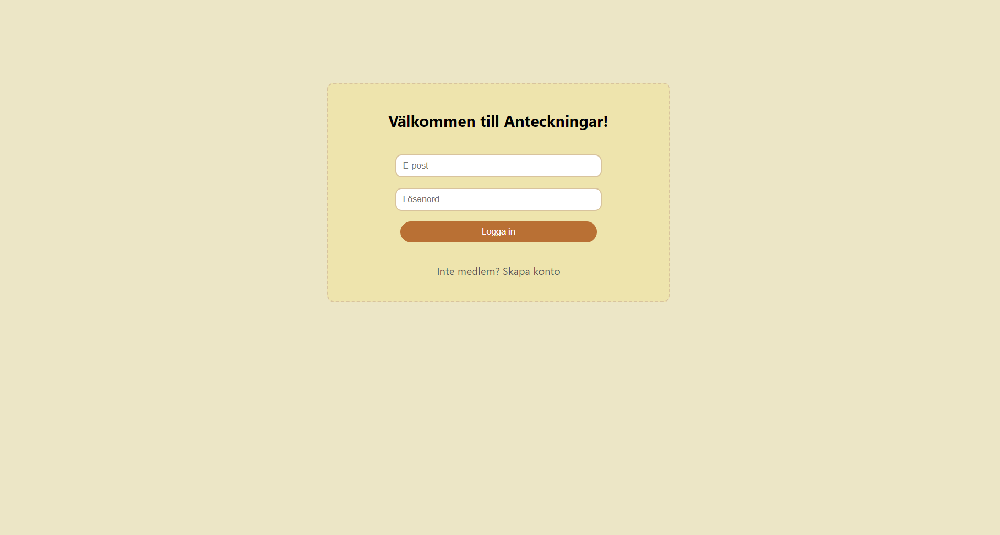
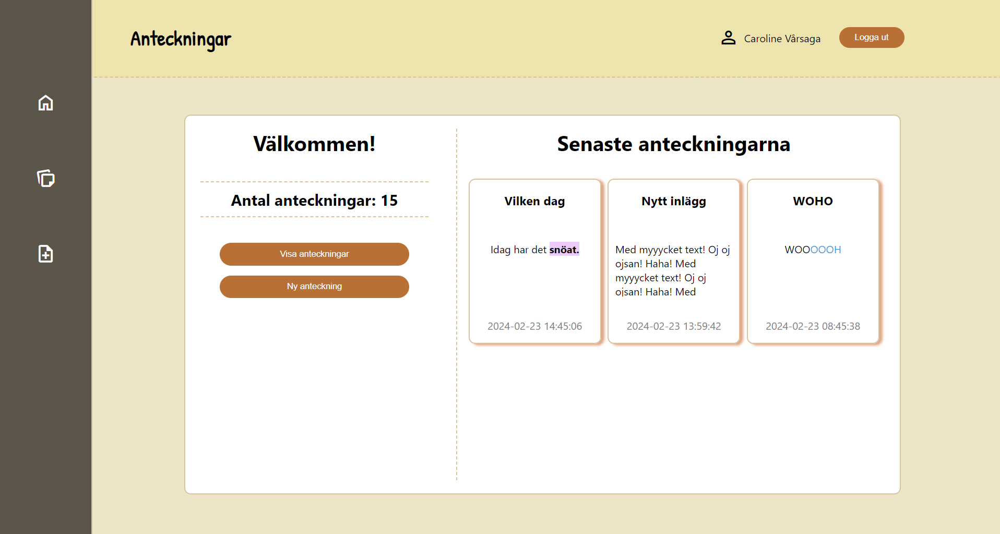
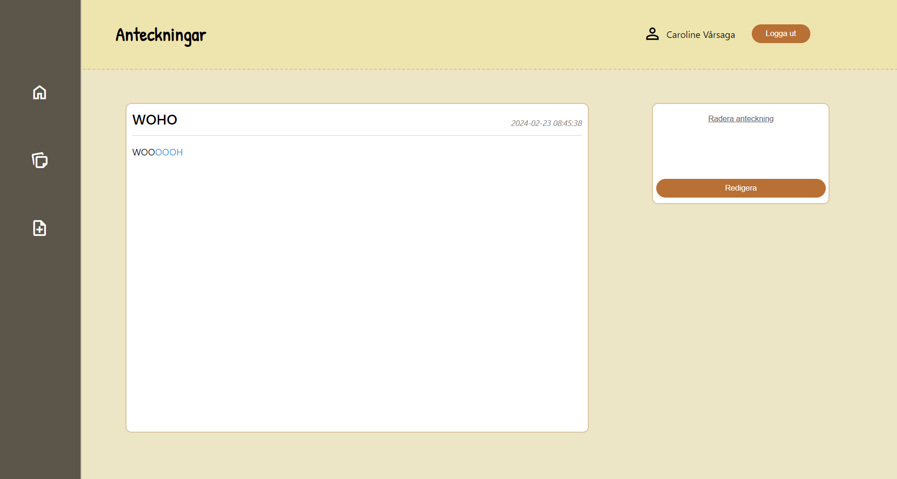
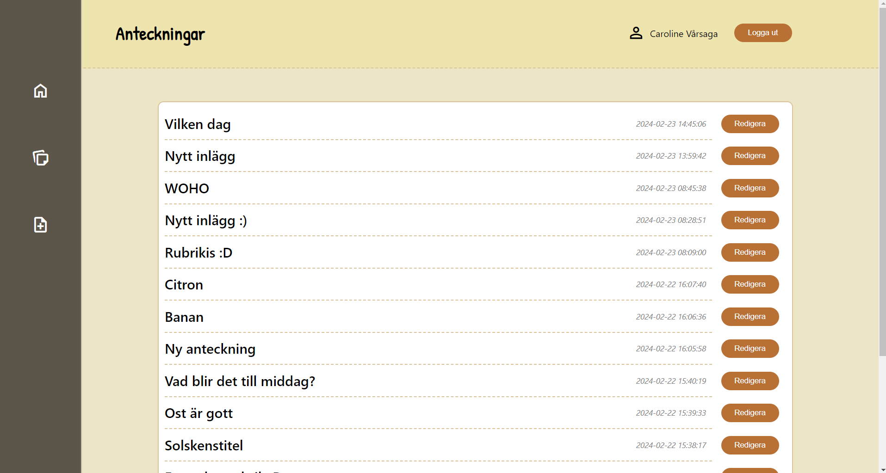
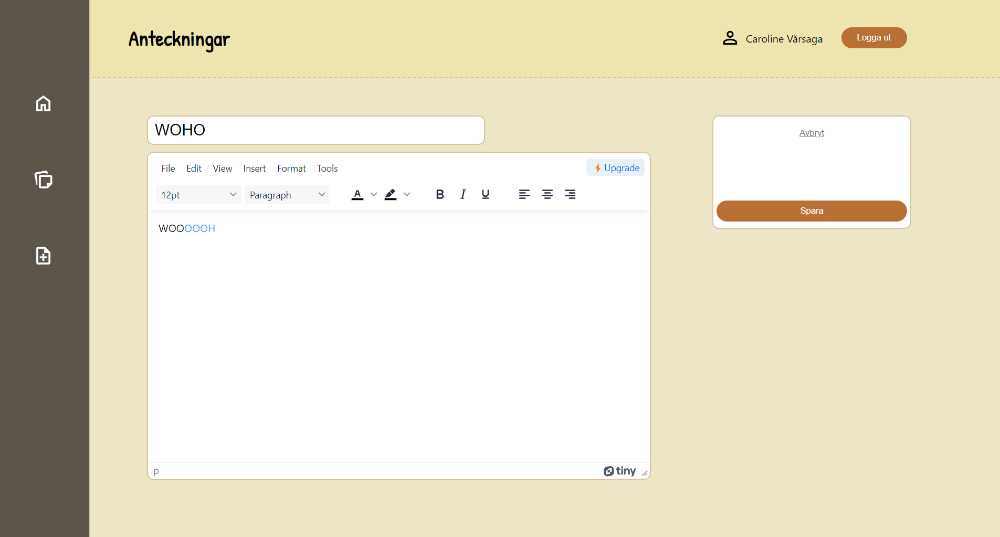
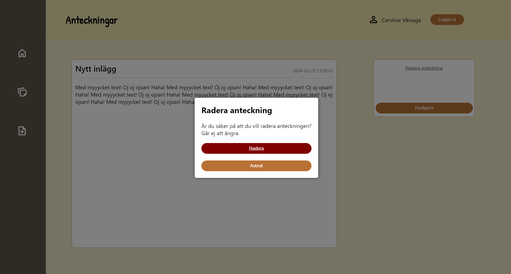
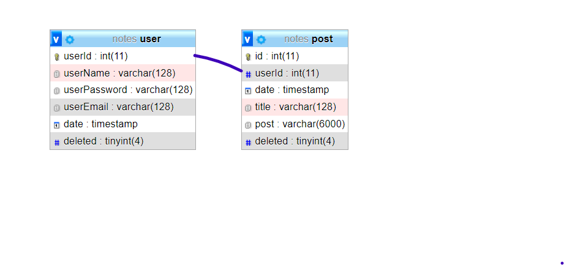

# Assignment - Notes
_Course: API development_
> Visit my project: https://github.com/CarolineVarsaga/notes-api

## WHAT I USED
### Back end: 
- Node js
- Express
- Express-generator
- Cors
- Nodemon 
- Dotenv
- Crypto-js
- Mysql2
### Front end:
- Tinymce
- Normalize
- Live server

## SCREENSHOTS
### Log in page

### Home page

### New post

### Display post

### All posts 

### Edit post

### Delete post

## ABOUT THIS PROJECT 
I am building a document management system with a relational database!  The assignment: 
 "You have a customer who wants to build their own system for creating digital documents and wishes to see a demo of this. The customer wants to be able to log in to their system, see a list of all created documents, be able to create new ones, and edit those that are already there. They also want to be able to delete a document. When the customer looks at a created document, they should have the option to view the document both 'live,' i.e., without the editing mode, and to see the document in editing mode."

### _General_
- There should be a login, but the level of security for the prototype is up to you (document how you have chosen to do it). 
- Documents should be created and saved in a MySql database. 
- The project should be designed as a headless application, i.e., with a frontend project and an API. 
- For documents, there should be a simple editor, where it is possible to write and change text. 
- A document should be able to be displayed in both editing and "normal" mode.
- All CRUD operations should be used. Create, Read, Update, Delete.
- It should be possible to create new users who can create their own documents. And only see their created documents. 
- There should be a WYSIWYG editor where it is possible to change both text color and background color in the editor, and it should be possible to save.

## ABOUT THE PROCESS AND THOUGHTS
I had 1,5 week to create this API. As usual, it felt like a huge task with not so much time. And as always, it felt so good to actually pull this off and be done even before deadline! 

Database relations: 

It has been very educational to work with databases.

### _Process_
Every time you click and navigate to a new page, it is rendered through JavaScript. I have almost no static HTML at all. 
 
The user password is encrypted, so you won't be able to see the real one in the database. 

I have 8 endpoints in this project. 
Users got 3 and posts got 5. 

User-endpoints: 
- Create user
- Log in user 
- Specific user (params, userId) 

Post-endpoints
- Post (get all posts from specific user)
- Update post
- Specific post (params, postId)
- New post
- Delete post

### _Obstacles_
One obstacle I encountered was that when I edited a post and then saved it, it wouldn't display in view mode. It was blank. But if I added a new post or clicked on an existing one, it could be displayed in view mode. I sat for probably a day and a half before I discovered that it wasn't sending the postId from the endpoint. It's amazing how such small things can always cause such big problems and real brain teasers!

## AUTHOR
_Caroline Vårsaga -2024_
 _Studying "Front End Developer" at Medieinstituet_
- GitHub: https://github.com/CarolineVarsaga
- LinkedIn: https://www.linkedin.com/in/caroline-varsaga